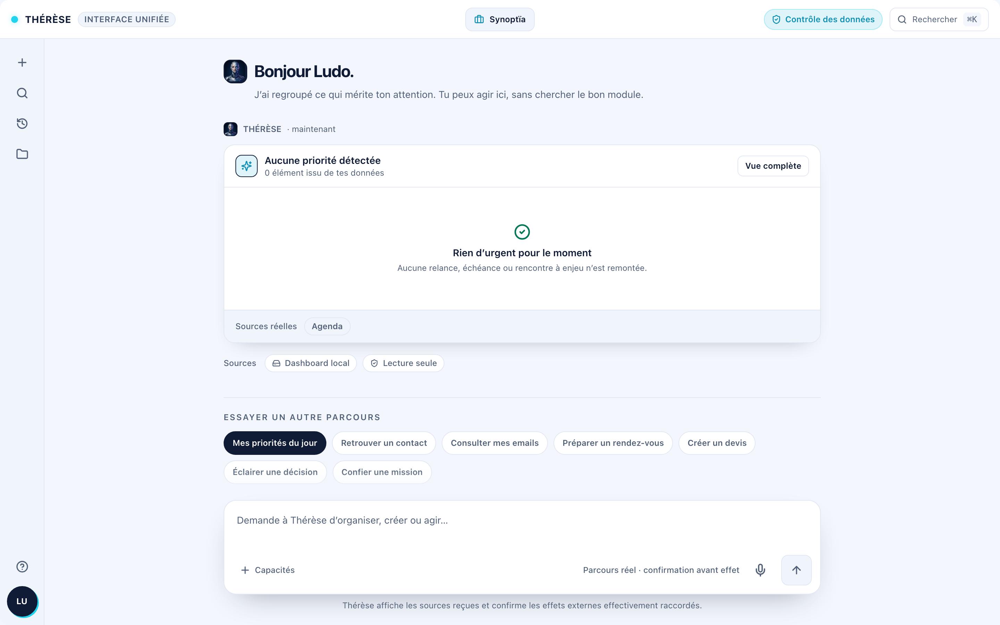

<p align="center">
  
</p>

<h1 align="center">THÉRÈSE</h1>

<p align="center">
  <strong>L'assistante IA desktop pour les entrepreneurs, TPE, mairies et associations françaises.</strong><br />
  <em>"Humain d'abord - IA en soutien"</em>
</p>

<p align="center">
  <a href="LICENSE"></a>
  <a href="https://github.com/ludovicsanchez38-creator/Synoptia-THERESE/actions"></a>
  
</p>

<p align="center">
  <strong>Open source et gratuit - pour toujours.</strong>
</p>

---

## Fonctionnalités

- **Chat multi-LLM** - Claude, GPT, Gemini, Mistral, Grok, Ollama (100% local)
- **Mémoire persistante** - Contacts, projets, fichiers : tout reste sur ta machine
- **Email et Calendrier** - IMAP/Gmail, CalDAV/Google Calendar intégrés
- **CRM et Facturation** - Local ou sync Google Sheets, PDF conforme (mentions légales FR)
- **Board de Décision IA** - 5 conseillers virtuels pour t'aider à trancher
- **18 skills intégrés** - Word, Excel, PowerPoint, emails pro, posts LinkedIn, propositions commerciales, analyses PDF/web, planification projets/semaine/objectifs
- **Recherche web** - Brave Search intégré
- **Dictée vocale** - Parle, THÉRÈSE écrit
- **Local-first** - Données chiffrées sur ta machine, rien dans le cloud
- **Atelier IA (v0.5)** - Deux agents embarqués qui améliorent l'app pour toi (voir ci-dessous)

## Atelier - Agents IA Embarqués (v0.5)

THÉRÈSE embarque deux agents IA open source qui travaillent ensemble :

- **Thérèse bot** (PM/Guide) : t'aide à comprendre l'app, traduit tes besoins en spécifications
- **Zézette bot** (Dev) : implémente les changements sur une branche git, lance les tests

**Comment ça marche** : tu décris ce que tu veux dans l'Atelier (`Cmd+Shift+A`), Thérèse comprend le besoin, Zézette code, et tu valides les changements avant qu'ils soient appliqués. Pas besoin de savoir coder.

**Open source** : les prompts des agents (`SOUL.md`) sont livrés avec le code. Tu peux les personnaliser dans `~/.therese/agents/`. Tu fournis ta propre clé API (BYOK), on ne livre aucun token.

**Compatible OpenClaw** : le format de configuration (agent.json + SOUL.md) est compatible avec [OpenClaw](https://github.com/anthropics/openclaw) (MIT).

## Télécharger (alpha)

> THÉRÈSE est en **alpha** avec 21 testeurs.

Les installeurs sont disponibles dans les [GitHub Releases](https://github.com/ludovicsanchez38-creator/Synoptia-THERESE/releases).

| Plateforme | Fichier |
|------------|---------|
| macOS (Apple Silicon) | `THERESE_x.x.x_aarch64.dmg` |
| Windows (x64) | `THERESE_x.x.x_x64-setup.exe` |
| Linux (x64) | `THERESE_x.x.x_amd64.deb` |

> **macOS** : Clic droit sur l'app > Ouvrir > Confirmer (Gatekeeper, app non signée pour l'instant).
> **Windows** : SmartScreen peut afficher un avertissement, clique sur "Informations complémentaires" > "Exécuter quand même".

Tu as besoin d'un **code d'accès au service IA** (appelé "clé API") pour utiliser THÉRÈSE. Anthropic est recommandé : [console.anthropic.com](https://console.anthropic.com). Ou utilise [Ollama](https://ollama.ai) pour un usage 100% local et gratuit.

## Premiers pas

1. **Télécharge et installe** la dernière build depuis les [Releases](https://github.com/ludovicsanchez38-creator/Synoptia-THERESE/releases)
2. **Suis l'assistant de configuration** qui te guide étape par étape
3. **Commence à discuter** avec THÉRÈSE !

Guide complet pour les testeurs : [docs/USER_GUIDE_ALPHA.md](docs/USER_GUIDE_ALPHA.md)

## Signaler un bug

- **Discord** : mentionne `@Thérèse bug : [description]` dans `#bugs`
- **GitHub** : ouvre une [issue](https://github.com/ludovicsanchez38-creator/Synoptia-THERESE/issues/new?template=bug_report.md)
- **Email** : ludo@synoptia.fr avec l'objet `[THÉRÈSE Alpha] Bug`

## Pour les développeurs

### Prérequis

- Python 3.11+ (via [UV](https://docs.astral.sh/uv/))
- Node.js 20+
- Rust stable (pour [Tauri 2.0](https://v2.tauri.app/))

### Installation et lancement

```bash
make install    # Installer toutes les dépendances
make dev        # Lancer backend + Tauri en mode dev
```

### Commandes utiles

```bash
make dev              # Backend + Tauri simultanés
make dev-backend      # Backend seul (uvicorn)
make test             # Tous les tests
make lint             # Vérifier le code (ruff + eslint)
make build-release    # Build complète de production
make help             # Toutes les commandes disponibles
```

Installation depuis les sources : [docs/GETTING_STARTED.md](docs/GETTING_STARTED.md)

## Stack technique

| Couche | Technologie |
|--------|-------------|
| Desktop | Tauri 2.0 (Rust) |
| Frontend | React 19, TypeScript 5, TailwindCSS 4, Zustand 5 |
| Backend | Python 3.11+, FastAPI, SQLModel, SQLite |
| Mémoire | Qdrant (vecteurs), sentence-transformers (embeddings) |
| LLM | Anthropic, OpenAI, Google, Mistral, Grok, Ollama |

## Structure du projet

```
Synoptia-THERESE/
├── src/
│   ├── frontend/           # React + Tauri 2.0 + TailwindCSS
│   │   ├── src/            # Composants, stores, hooks, services
│   │   └── src-tauri/      # Configuration Rust (Tauri)
│   └── backend/            # Python FastAPI
│       └── app/            # Routers, services, models, providers
│           └── agents/     # Configs Thérèse bot + Zézette bot (SOUL.md)
├── tests/                  # pytest + Vitest + Playwright
├── docs/                   # Documentation complète
├── scripts/                # Scripts de build et utilitaires
└── .github/workflows/      # CI/CD
```

## Documentation

| Document | Description |
|----------|-------------|
| [Guide Alpha](docs/USER_GUIDE_ALPHA.md) | Guide complet pour les testeurs |
| [Installation](docs/GETTING_STARTED.md) | Installation depuis les sources |
| [Contribuer](docs/CONTRIBUTING.md) | Guide de contribution |
| [API](docs/API.md) | Documentation de l'API backend |
| [Architecture](docs/architecture.md) | Architecture technique détaillée |
| [Changelog](docs/CHANGELOG.md) | Historique des versions |

## Sécurité

Voir [SECURITY.md](SECURITY.md) pour la politique de sécurité et le signalement de vulnérabilités.

## Licence

[AGPL-3.0](LICENSE) - Synoptïa (Ludovic Sanchez)

THÉRÈSE est un logiciel libre. Tu peux l'utiliser, le modifier et le redistribuer sous les termes de la licence AGPL-3.0. Si tu modifies THÉRÈSE et que des utilisateurs y accèdent (y compris via un réseau), tu dois publier ton code source modifié.

## Contribuer

Les contributions sont les bienvenues ! Consulte [docs/CONTRIBUTING.md](docs/CONTRIBUTING.md) pour les conventions et le workflow.

## Contact

**Ludo Sanchez** - [Synoptïa](https://synoptia.fr) - ludo@synoptia.fr

*"Humain d'abord - IA en soutien"*
