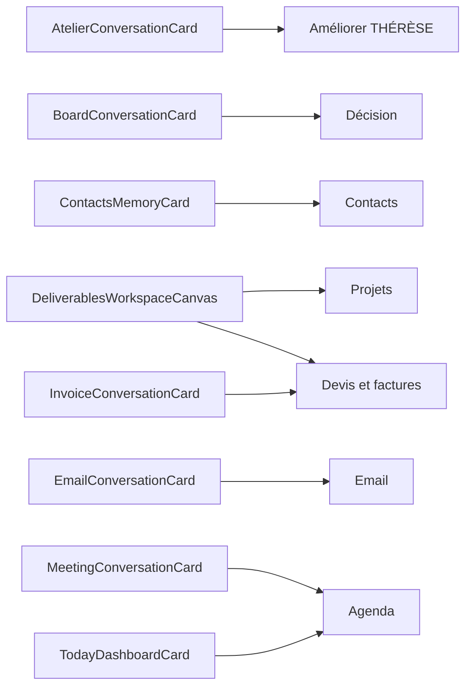

# Index des noms — THÉRÈSE 0.64.0

> **Généré depuis le code.** Ne pas modifier à la main : ce fichier est
> réécrit par `node scripts/index-des-noms.mjs` à chaque version. Si un nom
> change dans l'application, il change ici.

## Comment citer une surface dans un signalement

L'identifiant d'un contrôle, c'est **le texte visible à l'écran**.

- Si un contrôle n'a pas de texte visible, c'est un bug : signale-le.
- Si deux contrôles portent le même texte au même moment, c'est un bug aussi.
- Pour distinguer la carte de la vue : « sur la carte Agenda » (dans la
  conversation) et « dans la vue Agenda » (après avoir cliqué *Ouvrir Agenda*).

## Les cinq verbes de l'accueil

| Verbe | Ouvre la surface |
|---|---|
| **Écrire** | Écrire un message |
| **Retrouver** | Retrouver un contact |
| **Préparer** | Préparer un rendez-vous |
| **Facturer** | Facturer un client |
| **Décider** | Éclairer une décision |

## Les vues complètes

| Nom affiché | Identifiant interne |
|---|---|
| **Contacts** | `memory` |
| **Pipeline** | `crm` |
| **Email** | `email` |
| **Agenda** | `calendar` |
| **Tâches** | `tasks` |
| **Devis et factures** | `invoices` |
| **Fichiers** | `files` |
| **Projets** | `projects` |
| **Documents** | `documents` |
| **Décision** | `board` (panneau) |
| **Améliorer THÉRÈSE** | `atelier` (panneau) |

## Le Centre de capacités

Ce que l'application appelle « aide » dans son rail est un **lanceur** : il
ouvre les surfaces ci-dessus, il ne les documente pas.

### Organiser mon quotidien

| Capacité | Identifiant |
|---|---|
| Brief du jour | `daily-brief` |
| Email | `email` |
| Agenda | `calendar` |
| Tâches | `tasks` |
| Relances et alertes | `attention` |

### Développer mon activité

| Capacité | Identifiant |
|---|---|
| Contacts | `contacts-memory` |
| Pipeline | `crm` |
| Projets | `projects` |
| Devis et factures | `billing` |
| Livrables et suivi client | `deliverables` |

### Créer et produire

| Capacité | Identifiant |
|---|---|
| Rédiger un document | `document-workshop` |
| Word, PowerPoint et Excel | `office` |
| Images | `images` |
| Voix et transcription | `voice` |
| Modèles et variables | `prompts-variables` |

### Comprendre et décider

| Capacité | Identifiant |
|---|---|
| Recherche web | `web-research` |
| Fichiers | `files-rag` |
| Décision | `decision-board` |
| Calculateurs | `calculators` |
| Références juridiques | `legal` |

### Automatiser et déléguer

| Capacité | Identifiant |
|---|---|
| Actions et relances | `actions` |
| Améliorer THÉRÈSE | `agents` |
| Connecteurs | `mcp` |
| Skills et commandes | `skills-commands` |

### Maîtriser Thérèse

| Capacité | Identifiant |
|---|---|
| Services d’IA | `providers` |
| Données et RGPD | `privacy` |
| Sécurité locale | `security` |
| Coûts, limites et performance | `usage` |
| Profil et espace de travail | `profile` |
| Personnalisation | `personalization` |

## Les liens entre surfaces

Quelle carte de la conversation ouvre quelle vue complète. Le bouton
porte toujours le nom de sa destination (« Ouvrir <nom> »).

| Carte (dans la conversation) | Ouvre | Libellé du bouton |
|---|---|---|
| `AtelierConversationCard` | **Améliorer THÉRÈSE** | Ouvrir Améliorer THÉRÈSE |
| `BoardConversationCard` | **Décision** | Ouvrir Décision |
| `ContactsMemoryCard` | **Contacts** | Ouvrir Contacts |
| `DeliverablesWorkspaceCanvas` | **Projets** | Ouvrir Projets |
| `DeliverablesWorkspaceCanvas` | **Devis et factures** | Ouvrir Devis et factures |
| `EmailConversationCard` | **Email** | Ouvrir Email |
| `InvoiceConversationCard` | **Devis et factures** | Ouvrir Devis et factures |
| `MeetingConversationCard` | **Agenda** | Ouvrir Agenda |
| `TodayDashboardCard` | **Agenda** | Ouvrir Agenda |

