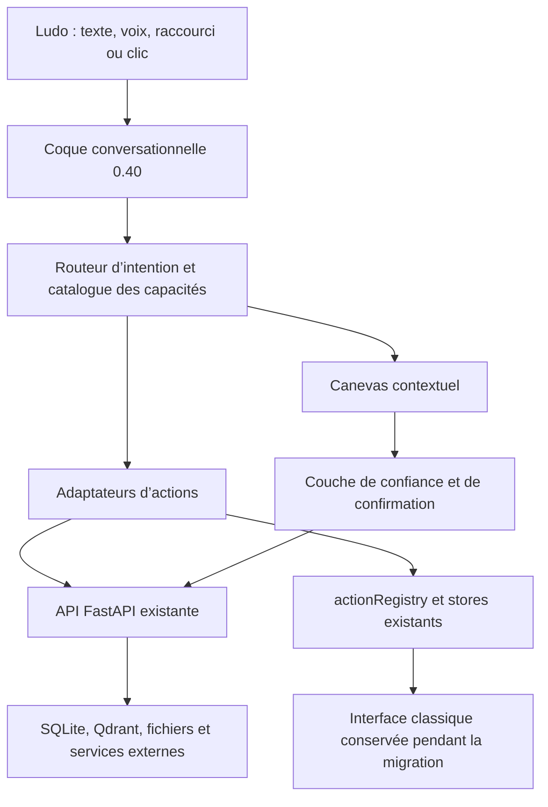

# Architecture cible de l’interface 0.40

## Vue d’ensemble



Le backend et les données restent la source de vérité. La 0.40 introduit une
nouvelle façon de présenter et d’orchestrer l’existant, pas un second système.

## Risque identifié et traitement local

L’audit a montré que le sélecteur local était placé avant l’ancien démarrage
applicatif. Le prototype contournait alors l’attente du sidecar, l’initialisation
du token, l’onboarding, l’accessibilité, les erreurs globales, les notifications
et l’updater.

Le démarrage commun est désormais porté par `ApplicationBootstrap`. Le choix
entre l’interface classique et la coque 0.40 intervient seulement après le
backend prêt, l’authentification initialisée et l’onboarding vérifié. Les deux
interfaces partagent aussi le cadre d’erreur, la réduction des mouvements, la
bannière de mise à jour, les notifications et les confirmations sensibles.

Ce traitement reste local. Il doit encore être vérifié dans l’application Tauri,
sur un premier démarrage et avec un backend momentanément indisponible avant de
pouvoir être considéré comme prêt pour une bêta. Les parcours migrent un par un.
Rendez-vous utilise maintenant un read-model isolé : aucun calendrier n’est créé
à l’ouverture et le store persistant de la vue classique n’est pas écrasé.

## Couches proposées

### 1. Coque conversationnelle

Elle gère le fil, la saisie, la navigation globale, les raccourcis et l’accès au
centre des capacités. Elle ne contient aucune logique métier propre à l’email,
au CRM ou à la facturation.

### 2. Catalogue des capacités

Une capacité est décrite par un identifiant stable, son intention, ses modes
lecture/brouillon/exécution, ses permissions et son adaptateur. Le catalogue du
prototype devient progressivement un registre exécutable. `actionRegistry.ts`
reste la porte d’entrée des actions déjà disponibles pendant cette transition.

Le catalogue comporte maintenant exactement 30 capacités et chacune déclare un
canevas 0.40 ou une destination explicite. Les destinations autorisées sont une
vue classique, une action enregistrée, un onglet de réglages, une reprise dans
le chat, un canevas spécialisé ou un état indisponible. Les 30 entrées ont un
débouché déterministe, mais cette exhaustivité de navigation ne vaut pas encore
parité métier : plusieurs capacités reposent toujours sur la vue classique.

Contrat cible minimal :

```ts
interface CapabilityDefinition {
  id: string;
  intent: string;
  risk: 'read' | 'draft' | 'external-effect';
  actionIds: string[];
  canvas: string;
}
```

Ce contrat est indicatif. Il ne doit être créé qu’au moment où un premier
adaptateur réel en a besoin.

### 3. Canevas contextuel

Le canevas affiche l’objet de travail sans changer d’application : fiche contact,
liste d’emails, proposition de rendez-vous, facture, délibération du Board ou
mission de l’Atelier. Chaque canevas doit prévoir quatre états : chargement,
contenu, absence de résultat et erreur récupérable.

### 4. Adaptateurs

Les adaptateurs traduisent une intention de la nouvelle interface en appels aux
stores et services existants. Ils évitent de dupliquer les règles métier dans les
composants visuels. Ils sont testables indépendamment du canevas.

Les vues historiques peuvent maintenant être montées dans la coque unifiée sans
rechargement ni bascule normale vers l’ancienne interface. Le pont exceptionnel
vers l’interface classique conserve une liste fermée d’actions et d’onglets. Une
demande qui doit réellement traverser ce pont est stockée une seule fois dans
`sessionStorage`, consommée au démarrage puis supprimée immédiatement. Son texte
n’est jamais placé dans l’URL. Les paramètres techniques de transition sont
également nettoyés après consommation.

Les calculateurs constituent un adaptateur spécialisé : le canevas appelle les
cinq endpoints locaux existants, affiche la formule avant exécution et n’envoie
rien au LLM. Le frontend et le backend refusent les résultats numériques non
finis afin qu’un dépassement ne puisse pas devenir un `null` JSON présenté comme
un calcul réussi.

Le suivi des livrables compose cinq lectures existantes sans créer de nouveau
modèle. Il charge d’abord les 200 projets récents, puis interroge le contact, les
livrables, les tâches et les factures uniquement pour le projet sélectionné.
Chaque section conserve son propre état de chargement, vide ou erreur et un
identifiant de requête empêche une réponse ancienne d’écraser une nouvelle
sélection. Comme les factures n’ont pas de clé projet ou livrable, leur seule
association est le `contact_id` du projet et cette limite reste écrite dans le
canevas.

Personnalisation ne crée pas un second système de préférences. La carte ouvre
les réglages déjà consommés par l’application : mode standard/contributeur,
comportement au lancement et accessibilité. Le passage vers un onglet précis est
porté par le store des panneaux jusqu’au montage différé de la modale, puis les
paramètres de transition sont nettoyés de l’URL.

### 5. Couche de confiance

Chaque capacité déclare son niveau d’effet :

| Niveau | Exemple | Comportement attendu |
|---|---|---|
| Lecture | résumer un contact | exécution directe, source visible |
| Brouillon | préparer un email | aperçu modifiable, aucune transmission |
| Effet externe | envoyer, créer, supprimer, publier | confirmation explicite avec destination et conséquence |

Les erreurs et les résultats doivent venir de la réalité d’exécution du backend,
pas d’un état optimiste uniquement visuel.

## Board et Atelier

Le Board devient un canevas de décision : question, conseillers, divergences,
synthèse, recommandation et historique. Les portraits illustrent les rôles, mais
les réponses restent reliées aux modèles, traces et données existantes.

L’Atelier devient un canevas de mission : cadrage, plan, agents mobilisés,
progression, artefacts produits, revue puis application. Une mission n’obtient
jamais implicitement plus de permissions que l’action demandée.

Le premier adaptateur Atelier couvre uniquement le swarm de changement de code.
Il impose `main`, un dépôt propre et un seul travail actif, puis crée un worktree
temporaire sur `agent/*`. La revue lit cette branche sans changer le checkout
utilisateur. Les profils autonomes, Action Agents et OpenClaw ne rejoignent le
canevas qu’après adoption du même protocole de permission et de confirmation.

## État et navigation

- L’URL ou l’état de navigation identifie le canevas et l’objet sélectionné.
- Les stores existants conservent l’état métier tant qu’ils restent pertinents.
- Le fil de conversation référence les objets par identifiant, sans recopier leur
  contenu complet dans le message.
- Les vues classique et 0.40 doivent pouvoir ouvrir le même objet.
- Les parcours raccordés n’utilisent aucune donnée simulée de secours.
- Une association événement-contact n’est acceptée que sur égalité exacte des
  adresses email normalisées ; le titre d’un événement ne suffit pas.
- Toute création Agenda issue du canevas, du LLM, de `/rdv` ou de `[rdv: ...]`
  produit d’abord un brouillon et une confirmation consommable une seule fois.
- Une capacité sans surface fidèle est désactivée avec une raison visible ; elle
  ne devient pas automatiquement un prompt générique.

## Données et migrations

La coque elle-même ne crée pas de deuxième stockage. Deux migrations Alembic
additives accompagnent toutefois la préparation locale :

- `c8d9e0f1a2b3` conserve sources web, provider, modèle et usage des décisions
  Board ;
- `d9e0f1a2b3c4` conserve phase, plan, tests, explication, événements, sorties
  agents, branche de base et commit des missions Atelier.

Elles sont couvertes par la vérification de tête Alembic et devront être testées
en aller-retour sur une copie représentative avant tout build candidat.

## Frontières de la 0.40

La 0.40 ne doit pas :

- réécrire tous les services backend ;
- créer une deuxième base ou un deuxième historique ;
- exécuter une action externe depuis une simple carte de suggestion ;
- supprimer l’interface classique avant la validation des parcours critiques ;
- présenter une donnée simulée comme une donnée utilisateur réelle.
