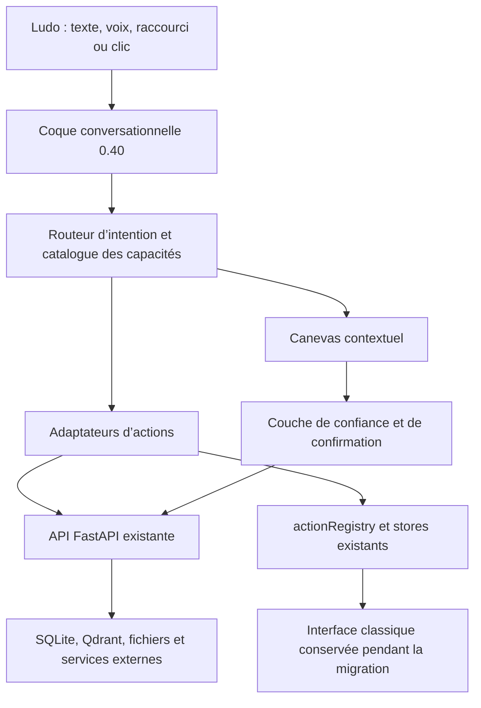

# Architecture cible de l’interface 0.40

## Vue d’ensemble



Le backend et les données restent la source de vérité. La 0.40 introduit une
nouvelle façon de présenter et d’orchestrer l’existant, pas un second système.

## Risque identifié et traitement local

L’audit a montré que le sélecteur local était placé avant l’ancien démarrage
applicatif. Le prototype contournait alors l’attente du sidecar, l’initialisation
du token, l’onboarding, l’accessibilité, les erreurs globales, les notifications
et l’updater.

Le démarrage commun est désormais porté par `ApplicationBootstrap`. Le choix
entre l’interface classique et la coque 0.40 intervient seulement après le
backend prêt, l’authentification initialisée et l’onboarding vérifié. Les deux
interfaces partagent aussi le cadre d’erreur, la réduction des mouvements, la
bannière de mise à jour, les notifications et les confirmations sensibles.

Ce traitement reste local. Il doit encore être vérifié dans l’application Tauri,
sur un premier démarrage et avec un backend momentanément indisponible avant de
pouvoir être considéré comme prêt pour une bêta. Les scénarios du prototype
restent par ailleurs alimentés par des données simulées.

## Couches proposées

### 1. Coque conversationnelle

Elle gère le fil, la saisie, la navigation globale, les raccourcis et l’accès au
centre des capacités. Elle ne contient aucune logique métier propre à l’email,
au CRM ou à la facturation.

### 2. Catalogue des capacités

Une capacité est décrite par un identifiant stable, son intention, ses modes
lecture/brouillon/exécution, ses permissions et son adaptateur. Le catalogue du
prototype devient progressivement un registre exécutable. `actionRegistry.ts`
reste la porte d’entrée des actions déjà disponibles pendant cette transition.

Le registre actuel couvre surtout la navigation et environ deux douzaines
d’actions. Il ne représente pas encore les 30 capacités ni leurs variantes
lecture/brouillon/effet externe. Il doit être étendu par adaptateurs, sans être
considéré prématurément comme une parité complète.

Contrat cible minimal :

```ts
interface CapabilityDefinition {
  id: string;
  intent: string;
  risk: 'read' | 'draft' | 'external-effect';
  actionIds: string[];
  canvas: string;
}
```

Ce contrat est indicatif. Il ne doit être créé qu’au moment où un premier
adaptateur réel en a besoin.

### 3. Canevas contextuel

Le canevas affiche l’objet de travail sans changer d’application : fiche contact,
liste d’emails, proposition de rendez-vous, facture, délibération du Board ou
mission de l’Atelier. Chaque canevas doit prévoir quatre états : chargement,
contenu, absence de résultat et erreur récupérable.

### 4. Adaptateurs

Les adaptateurs traduisent une intention de la nouvelle interface en appels aux
stores et services existants. Ils évitent de dupliquer les règles métier dans les
composants visuels. Ils sont testables indépendamment du canevas.

### 5. Couche de confiance

Chaque capacité déclare son niveau d’effet :

| Niveau | Exemple | Comportement attendu |
|---|---|---|
| Lecture | résumer un contact | exécution directe, source visible |
| Brouillon | préparer un email | aperçu modifiable, aucune transmission |
| Effet externe | envoyer, créer, supprimer, publier | confirmation explicite avec destination et conséquence |

Les erreurs et les résultats doivent venir de la réalité d’exécution du backend,
pas d’un état optimiste uniquement visuel.

## Board et Atelier

Le Board devient un canevas de décision : question, conseillers, divergences,
synthèse, recommandation et historique. Les portraits illustrent les rôles, mais
les réponses restent reliées aux modèles, traces et données existantes.

L’Atelier devient un canevas de mission : cadrage, plan, agents mobilisés,
progression, artefacts produits, revue puis application. Une mission n’obtient
jamais implicitement plus de permissions que l’action demandée.

## État et navigation

- L’URL ou l’état de navigation identifie le canevas et l’objet sélectionné.
- Les stores existants conservent l’état métier tant qu’ils restent pertinents.
- Le fil de conversation référence les objets par identifiant, sans recopier leur
  contenu complet dans le message.
- Les vues classique et 0.40 doivent pouvoir ouvrir le même objet.
- Les données simulées du prototype disparaissent capacité par capacité.

## Données et migrations

La première phase ne nécessite aucune modification de schéma. Si une capacité
requiert ensuite un nouvel état persistant, la modification passe par Alembic,
avec sauvegarde, procédure de retour et test sur une copie de base réelle.

## Frontières de la 0.40

La 0.40 ne doit pas :

- réécrire tous les services backend ;
- créer une deuxième base ou un deuxième historique ;
- exécuter une action externe depuis une simple carte de suggestion ;
- supprimer l’interface classique avant la validation des parcours critiques ;
- présenter une donnée simulée comme une donnée utilisateur réelle.
